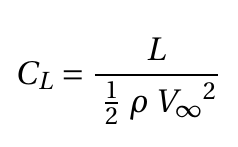
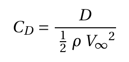
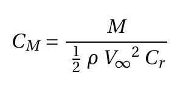
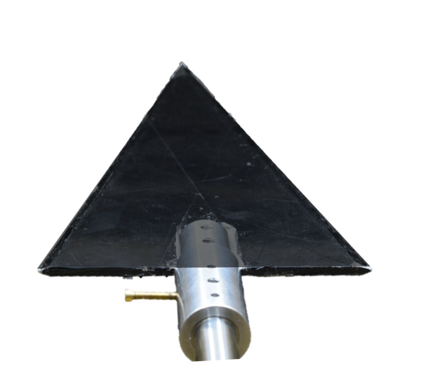
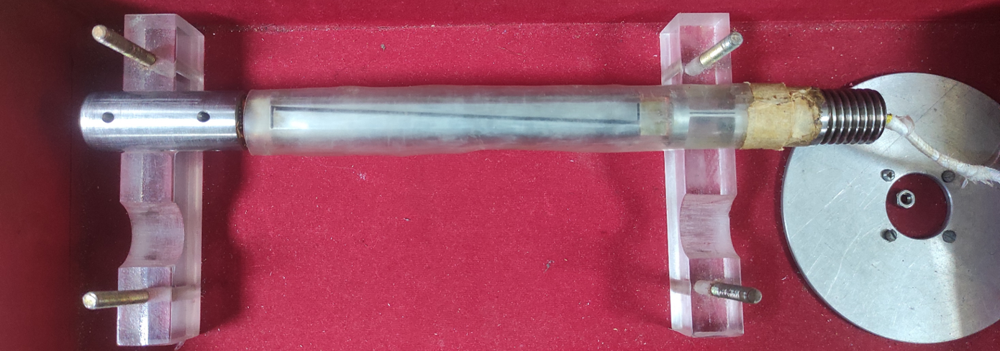
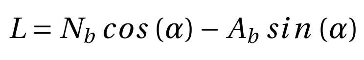
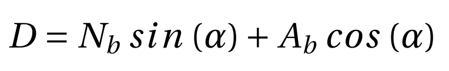
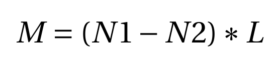

# Theory:

Delta wing is a special case of the swept back wings where the trailing edge is not swept according to the leading edge. Therefore, the shape of the planform results like the Greek alphabet delta (Δ), hence the name Delta wing. The advantages of delta wing are crucial for enhanced performance in supersonic flow but it also offers superior performance in the regime of low Reynolds number flow.
 

The figure illustrates the flow features of the subsonic flow over the suction surface of the delta wing at an angle of attack for Reynolds number ranging 103 to 105. The dominant feature, in the flow past a delta wing, is a pair of counter-rotating vortices developing in the vicinity of the leading edge. At an angle of attack, the flow separates at the leading edge on the bottom surface and rolls up to curls around the leading edge from the bottom to the top. These separated flow after rolling into a core becomes what is widely known as the primary vortex. This is no different than what we observe in the case of an airfoil. The primary vortex is called as Leading Edge Vortex (LEV). This primary vortex separated from the leading edge reattaches on the suction surface due to the increased vorticity which makes suction pressure on the top surface stronger and more negative. On the other hand, the pressure on the bottom remains positive due to the stagnation. This strong suction peaks along the leading edge results in vortex-induced lift. As long as this reattachment exists undisturbed, sustainable steady lift generation continues. These attached stream surface further spans towards the leading edge and separates again in the vicinity of the leading edge but in this case on the top surface and with a sense of rotation opposite to the corresponding primary vortex. These new vortices are known as the secondary vortex. The flowfield around a delta wing maintains this for a larger range of angle of attack compared to a rectangular/elliptic and even the swept back wing because in the case of the delta wing, at the higher angles of attack the lift generation is not influenced by the airfoil cross-section but instead by the vortex induced lift. However, at very high angles of attack, the pressure in the downstream becomes unfavorable for the lift generation and an adverse pressure gradient is experienced in the chord-wise direction leading to separation from the trailing edge. With increasing angles of attack, the separation bubble moves upstream and the vortex becomes unstable. The vortex loses its strength and the core disintegrates. This phenomenon is called vortex breakdown. At a very large angle of attack, the vortex breakdown occurs in the vicinity of the apex and the whole flow on the suction surface witness separation. At a fairly large angle of attack before this happen, the lift generation stalls and the lift slope becomes negative. However, this value of angle of attack is very large compared to the other planforms. The drag force over the complete range of angle of attack keeps rising due to the stronger pressure drag and the lift induced drag produced by the delta wing. Also, the pitching moment produced is strong and stabilizing due to the higher lift force produced overall.

### I.	By definition of Coefficient of aerodynamic forces and moments can be given by

 &nbsp;&nbsp;&nbsp;&nbsp;&nbsp;&nbsp;&nbsp;&nbsp;&nbsp; (1)

 &nbsp;&nbsp;&nbsp;&nbsp;&nbsp;&nbsp;&nbsp;&nbsp;&nbsp; (2)

 &nbsp;&nbsp;&nbsp;&nbsp;&nbsp;&nbsp;&nbsp;&nbsp;&nbsp; (3)

here,

L – Lift force

CL – Coefficient of lift

D – Drag force

CD – Coefficient of drag

M – Pitching moment

CM – Coefficient of pitching moment

V∞– Freestream velocity

ρ – Density of the air

Cr – Root chord

## Apparatus
- Delta wing model
- Wind tunnel
- 3 Component sting balance
- Data acquisition system

## Delta wing model

A delta wing model with wing span (b) and root chord length (Cr) of 15 cm is used in the experiment. The planform area (S) is 112.5 cm2. Therefore, the aspect ratio (AR= b2/S) is 2. The model is placed in the test section and the mounting mechanism allows to attain any required angle of attack. The trailing edge is tethered to the sting balance.
 
## Wind Tunnel

An open return low subsonic suction-type atmospheric wind tunnel generates the flow a 1-D uniform steady flow in the test section, where the model is placed/mounted. Wind tunnel components are a honeycomb section, a settling chamber, a contraction cone, a test section, a diffuser, a suction fan, and a motor. The air from the atmosphere enters the tunnel through the honeycomb section. Honeycomb reduces the turbulence from the atmosphere by breaking down the disturbances and stretching the flow due to its structure. The flow then goes through the settling chamber, which has two wire meshes, further reducing incoming turbulence. The settling chamber has a large volume which further dissipates any disturbances. The contraction cone increases the velocity by reducing area at the expense of pressure. There are two pressure tapings in the wind tunnel; one at the settling chamber, which gives stagnation or total pressure, and the second at the end of the contraction cone, which gives static pressure. The difference in these two pressure is used to calculate the inlet velocity of the test section. The test section is a constant cross-section area where we achieve a one-dimensional, steady, and uniform flow. Models are mounted in this part for the test. Diffuser has two functions: one, it reduces the velocity and increases the pressure leading to the suction fan, which results in less work required by the fan; and two, it provides a gradual decrease in velocity or increase in pressure after the test section, which prevents any flow separation and backflow. The suction fan creates the necessary pressure difference required to maintain the airflow. The fan is run by the motor, which can run at different rpm to create a range of velocity. The rpm of the motor is controlled by a variable frequency drive (VFD). 

## 3 Component sting balance

 

The model is attached to a three-component strain gauge based sting balance.  The three components are two normal (N and N2) and one axial (A) force. The electrical resistance of a strain gauge changes as it is stretched or contracted. According to the Ohms law, if a constant current is applied to the bridge of gauges, the voltage will change as per the changes in the resistance of the gauge. These changes are compared against calibrated values of dead weights to determine the changes in resistance as the loads measured. The forces acting on the tip of sting balance are the body forces acting on the model: body normal (Nb) and body axial (Ab) force. These forces can be transformed from the body axes to the stability axes to determine the aerodynamic forces lift (L) and drag (D) using the following relationships.

 &nbsp;&nbsp;&nbsp;&nbsp;&nbsp;&nbsp;&nbsp;&nbsp;&nbsp; (4)

 &nbsp;&nbsp;&nbsp;&nbsp;&nbsp;&nbsp;&nbsp;&nbsp;&nbsp; (5)

The sting balance records the normal force (Nb) in the two components N1 and N2 Therefore, the total normal force is Nb = N1+N2. The pitching moment (M) can be calculated using the normal forces N1 and N2 by the following equation:

 &nbsp;&nbsp;&nbsp;&nbsp;&nbsp;&nbsp;&nbsp;&nbsp;&nbsp; (6)

Here, L is the distance between the strain gauge bridges for N1 and N2. In the present case, L is 65 mm. The data acquisition system used in the setup measure the voltage changes and convert them to the load based on the calibration data. The daq systems outputs the mean values for L, D and PM for every case of measurement.

 
